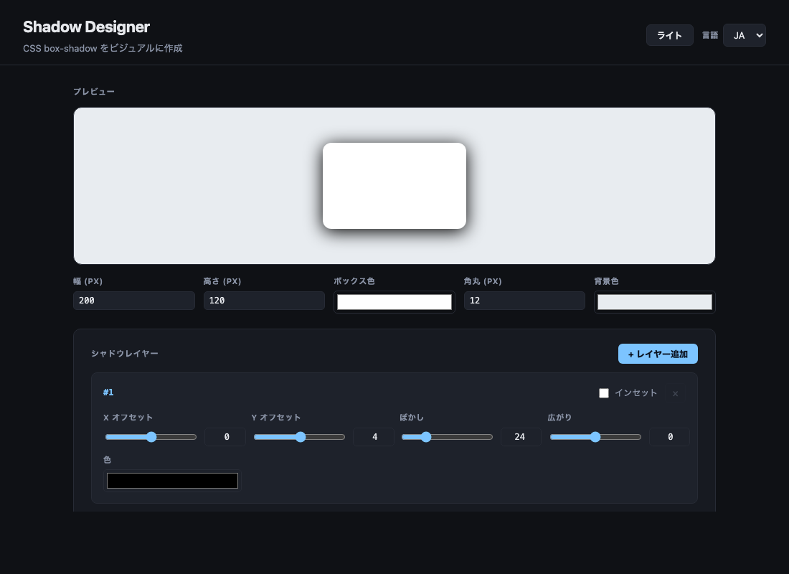

# Shadow Designer

[](https://sen.ltd/portfolio/shadow-designer/)

CSS box-shadow をビジュアルに作成。複数レイヤ対応、5 プリセット、即プレビュー。

**Live demo**: https://sen.ltd/portfolio/shadow-designer/



## 特徴

- Multiple shadow layers (add / remove freely)
- Per-layer controls: offsetX, offsetY, blur, spread, color, inset toggle
- 5 presets: Soft, Neumorphism, Glassmorphism, Layered, Brutalist
- Live preview with customizable box (size, background, border-radius, canvas color)
- Copy-ready CSS output
- Japanese / English UI
- Dark / light mode toggle
- Zero dependencies, no build step

## ローカル起動

```sh
npm run serve
```

ブラウザで http://localhost:8080 を開く。

## テスト

```sh
npm test
```

Node.js built-in test runner (`node --test`) を使用。ビルドステップ不要。

## ライセンス

MIT. See [LICENSE](./LICENSE).

<!-- sen-publish:links -->
## Links

- 🌐 Demo: https://sen.ltd/portfolio/shadow-designer/
- 📝 dev.to: https://dev.to/sendotltd/a-css-box-shadow-designer-that-keeps-each-layer-as-a-plain-object-6mk
<!-- /sen-publish:links -->
